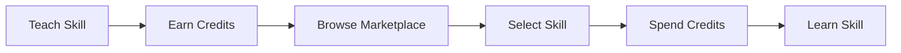

<!-- Kambio README -->

<p align="center">
  
</p>

<p align="center">
  <b>Asynchronous Skill Exchange Prototype</b><br/>
  <sub>Learn · Teach · Earn</sub>
</p>

---

## Overview

Kambio is a frontend prototype exploring a different model for peer-to-peer skill exchange.

Instead of relying on direct barter (where two users must need each other's skills at the same time), Kambio introduces a **credit-based system**:

- Earn credits by teaching or completing tasks  
- Spend credits to learn from others  
- Enable asynchronous participation across the platform  

---

## Interface Preview

<p align="center">
  
</p>

---

## Core System



---

## Features

### Marketplace
- Structured skill listings  
- Provider profiles  
- Simulated browsing experience  

### Credit Economy
- Earn / spend flow  
- Balance tracking  
- UI-driven transactions  

### Dashboard
- Activity overview  
- Credit visibility  
- Learning & teaching states  

### State Simulation
- Local mock data  
- React hooks (useState / useEffect)  
- No backend dependency  

---

## Design Approach

The interface is intentionally minimal:

- Geometric layout system  
- Neutral color palette  
- Consistent spacing and hierarchy  
- Focus on clarity over decoration  

---

## Tech Stack

- **Frontend:** React (hooks-based)
- **State:** Local state + mock data
- **Styling:** CSS / Tailwind (optional)

---

## Project Structure

```
src/
├── components/
├── pages/
├── data/
├── hooks/
└── styles/
```

---

## Setup

```bash
git clone https://github.com/your-username/kambio.git
cd kambio
npm install
npm run dev
```

---

## Notes

This is a **frontend-only prototype** built for demonstration and presentation.

No backend services, authentication, or persistence are implemented.

---

## Future Direction

- Backend integration  
- Authentication system  
- Real-time messaging  
- Rating & reputation system  
- Recommendation engine  

---

<p align="center">
  
</p>
